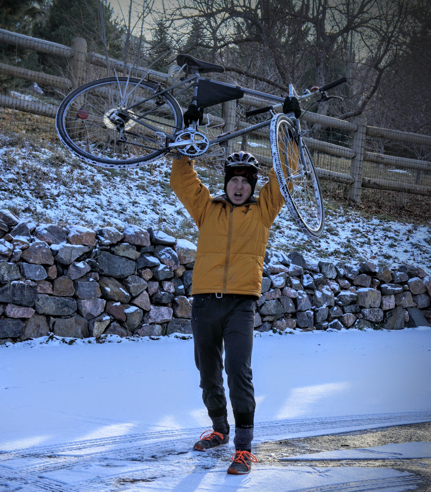

> _Note:_ This was originally written for my 'Common App' college application, in response to the essay prompt “Describe a place or environment where you are perfectly content. What do you do or experience there, and why is it meaningful to you?”

Fourteen years ago I learned how to bike, but six months ago I learned why. Six months ago I discovered the true power of biking, not just as a form of transportation, but also as a tool for improving personal and planetary health. My embrace of cycling began as an environmental gesture: I decided for all the global-warming-related fear I bear, I should explore the viability of biking more and driving less. This seemed like a simple action I could take to directly reduce my carbon footprint, and while I anticipated the change would make my life harder and less comfortable, that was a sacrifice I felt willing to make. Before long, however, I found biking was not a sacrifice at all, but rather… a gift. I have discovered that biking creates a space in my life to connect with my mind, body, and environment, in a society where that space can be hard to find.

In the fast-paced, hyper-connected haze of modern life, it can be difficult to find a quiet moment. After eight hours in school, my attention turns to homework, friends, family, and various hobbies and commitments. When down time arrives, an endless assortment of songs, videos, articles, and status updates readily fills it, ensuring my mind is constantly occupied. On my bike, everything slows down, and I finally have a chance to process all the information I have consumed. Consequently, a quiet bike ride is often the most creative and self-reflective part of my day.

In a society where movement has been rendered largely unnecessary by machines, I am grateful, too, for the exercise biking provides. With each ride, I have an opportunity to challenge myself— to push my body and discover its limits. The more I bike, the stronger my legs become, enabling me to complete my commutes faster, and with greater ease. When I step off my bike, I feel healthy, happy, and invigorated. That renewal of strength and energy carries into every aspect of my life.

Furthermore, as I feel sun on my skin and wind in my face, I experience a connection to my environment that can be deeply gratifying. In a car, I am loud, destructive, and oblivious to what’s around me; I feel like a tyrannical master of the world. On my bike, I am a humble traveler, quietly dancing with my environment. In adverse Colorado weather, the comforts of driving can become tempting, but I have discovered the discomforts of biking can be even more enjoyable. To get soaking wet, to get freezing cold, to sweat and struggle and fly, is to become awake, alive, and aware of the beautiful diversity of the human experience!

I began biking for the planet: to mitigate my contribution to global warming. I continue biking for myself: for the joy of clearing my mind, strengthening my body, and engaging with my environment. Indeed, it is my belief that personal and planetary health are inextricably intertwined, and there is great wisdom in the realization that what’s good for the planet is good for you. When we grow pesticide-free foods, protect pristine wilderness from industry, curb pollution, and resist the insidious pull of frantic consumerism by choosing to buy fewer things, I believe we benefit just as much as the planet does. Despite these convictions, I often struggle to align my actions with my beliefs, and feel tension and sadness as a result. When I step onto my bike, I transcend my hypocrisies, and become the person I want to be. I feel reaffirmed in my beliefs, because I am able to experience their validity firsthand: I am doing what’s right for the planet, and I am benefiting, not suffering, as a result. On my bike I feel strong, connected, and my purpose is clear. On my bike, I am perfectly content.

