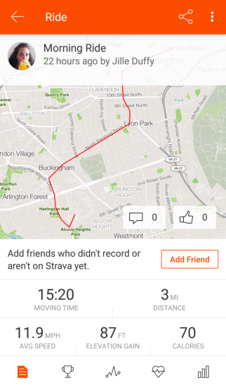

I recently started using [Strava](https://www.strava.com) to track my runs and bike rides. It's a fitness tracking app and social media platform, primarily focused on running and cycling. You can log other workout too but its not very interesting to do so because Strava puts the map front and center. Beneath the map are a few key metrics: distance, time, average speed. You can also upload pictures, which, by default, take center stage instead of the map. You can follow friends, see their activities, comment and click to give "kudos."

Lately I've been reflecting how the metrics the app highlights influence my thinking and behavior.

For example, speed and distance are prominent and easy-to-understand metrics. On the "progress" tab, Strava charts trends over time. Having the data can be very motivating. I want to run faster and bike further than I did last week.

The problem is that these metrics don't tell the whole story. Biking in the wind can be dramatically harder than biking on a calm day. So, you can put in a tremendous effort and get an excellent workout, but still feel disappointed when you see the dismally low scores. (Some athletes say "heart rate" is a more meaningful metric since it reliably relates effort, but that's more complicated to measure and interpret.)

Even more worrisome, one can fall into the trap of sacrificing important aspects of a workout like safety, comfort, and enjoyment in pursuit of better metrics. Since I can run faster on a flat, hard surface than on a winding and uneven trail, I caught myself planning runs along the sides of busy roads. Running on a trail would have been not only safer and more enjoyable but also likely better for my joints and long-term health, but the road is faster.

A popular adage says "what gets measured gets managed." The designers for tracking apps like this have great power (and great responsibility) because what you help users measure can shape their behavior. I began to wonder what it would look like to design an app like Strava that truly optimizes for safety, comfort, and enjoyment. Perhaps metrics like novelty (running a new route), social (running with a friend), and subjective enjoyment could be highlighted? Perhaps the app could caution you about ramping up too quickly instead of just celebrating your progress?

As I thought about this, I realized how unique Strava already is in the fitness app landscape. Many other popular fitness tracking apps exist primarily to assist with weight loss, so the focus is entirely on calories burned and weight trends over time. Some also include food tracking features. If weight loss was not your primary goal, the intense focus on weight and calories may be uninteresting at best or potentially even lead to body image concerns or disordered eating.

Strava doesn't really care about your weight at all. It can record it for use in calculating other metrics, but it's never charted or shared. The focus instead is on what you can do-- how fast and how far you can go.

And Strava puts the map front and center. I underestimated at first how significant that design choice is. The map is not a metric but a story. It's a reminder of where you went and what you saw. It's not easy to compare maps between people or week to week. It's just fun and cool.

As Olga Tokarczuk says:[^1]

> "Nothing cures melancholy like looking at maps."

Also, Strava _does_ track if you rode or ran with friends, it lets you upload photos (again to tell a story and celebrate the experience), it lets you mark how a workout _felt_, and it encourages you to give "kudos" to your friends to celebrate their accomplishments.

Even though metrics like speed and distance can become problematic if a user over-fixates on them, overall Strava's team has done an excellent job of balancing those metrics with other design tricks that encourage adventure, social connection, and fun.

[^1]: [Olga Tokarczuk, "Flights", 2019.](https://www.penguinrandomhouse.com/books/565058/flights-by-olga-tokarczuk-translated-by-jennifer-croft/)
