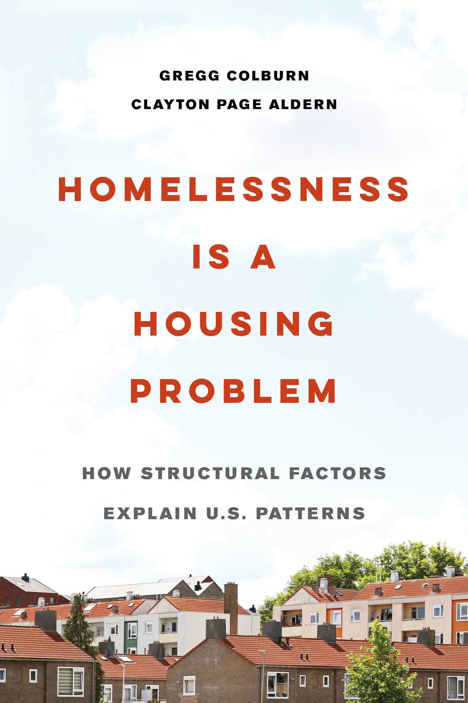

Living in Denver, homelessness is an increasingly visible problem. There are several major encampments that move around, vexing residents, and periodically being raided by police in a cruel display of state violence. At Central Station you find homeless people sleeping on benches, lacking any alternative day shelter. The sleeping is not so disruptive, but sometimes you find people openly injecting drugs, yelling, or defecting-- dissuading people from using public transit, and leaving the city scrambling for solutions. (Hint: a day shelter seems like a potential solution.)

After many conversations with my roommate about what is causing the rise in homelessness and what can be done about it, I decided to buy the book ["Homelessness is a Housing Problem"](https://homelessnesshousingproblem.com/) by Gregg Colburn and Clayton Page Aldern, and we read it together.

The main argument is right there in the title: **homelessness is a housing problem.**

This is contrary to popular belief. In the public imagination, personal vulnerabilities like drug use, mental illness, and poverty are usually blamed for homelessness. Even if you ask homeless people themselves how they ended up homeless (as the authors document) you hear myriad specific reasons, including drug use and job loss. The most common one is a breakup. At the individual level, there are many varied personal journeys that lead someone to homelessness. Lack of affordable housing is rarely perceived as the driving force.

But the authors argue that while these types of vulnerabilities can push someone into homelessness, they are not the root cause. The methodology that the authors use, which I find brilliant and convincing, is to ask:

> What forces can account for the different levels of homelessness between different cities?

While some major cities have large and growing homeless populations-- like Denver, LA, and San Francisco-- others do not. Georgia is relatively low. Is this because Georgia has less drug use? Less mental illness? Less poverty?

The answer is no. In fact, rates of homelessness tend to be _lower_ where poverty rates are higher.

The best explanatory variable is rent, which in turn is explained by the supply of housing. When housing is plentiful, and rent is low, homelessness is low. When housing is scarce, and rent is high, homelessness is high. Simple as that.

Yes, drug use and mental illness and poverty can all increase an individual's vulnerability, but if rent is low it is more likely they can continue to find a place to live. With every dollar increase in average rents, more and more people that could previously find housing are suddenly pushed into homelessness.

I love this book because the argument is so clearly reasoned and effectively argued. In the social sciences, it can be challenging to run scientific experiments without the luxury of being able to control variables and subject different groups of people to different treatments. It is often necessary to find situations in the real world that are as close to controlled experiments as possible. I think way the authors compare different cities with different rates of homelessness and search for the best explanatory variable is a great way to do this.

I also like the way the authors distinguish between inciting incidents, like job loss, and root causes. It would be easy to fall into the trap of studying this problem by asking homeless people how they wound up homeless and comparing there responses.

_Hmm... 40% say they lost a job, 30% say they broke up with a partner they lived with, 20% say they have a drug problem, etc._

While these are factors that can "cause" homelessness, they are messy, complicated, and they divide our attention. There is no obvious public intervention to protect people from losing their jobs or breaking up with their partners, for example. Poverty _can_ be addressed through policy, though it may feel like a daunting, intractable problem.

Building more housing, on the other hand, is a concrete and actionable suggestion, that makes the problem of homelessness feel solvable.

It takes a thoughtful and creative approach to look beyond the explanations people give for their own plight, and search for a more fundamental, unifying cause, that can actually be meaningfully addressed.
