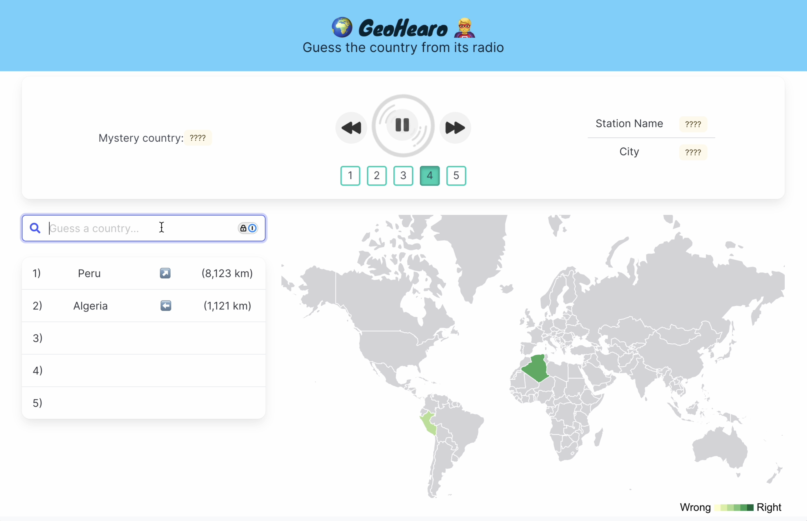
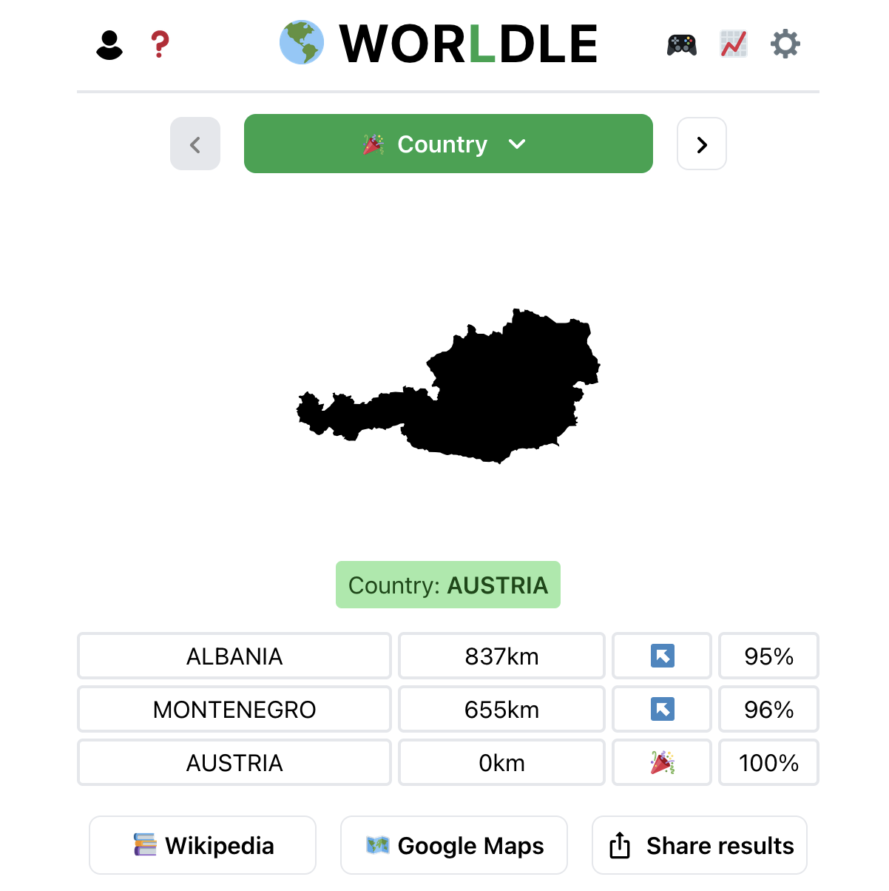
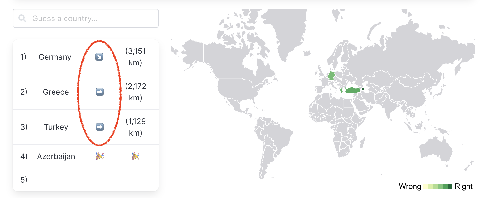
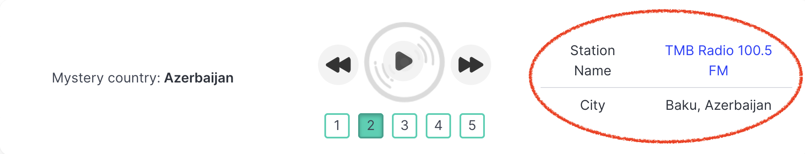

> Updated: December, 2024.

I created an audio-based geography game called [GeoHearo](https://geohearo.com/). When the game begins, a mystery country is chosen at random and you are presented with five radio stations to pan through. As you submit your guesses, the game tells you how close you are and which direction to go.

The game relies on your knowledge and challenges your preconceptions about the musical tastes and spoken languages of different countries. It can be used to build familiarity the countries of the world, where they lie, and what they sound like.



The map is provided as a visual aid. You can hover a country to check it's name, and your guessed countries are filled with a color that reflects how close to correct.

The game ends after five guesses or when the correct country is found. At that point, the names and specific locations of the radio stations are revealed and you can continue to listen or start again.

## Background

This project takes inspiration from two existing goe-guessing games.

The first is the eponymous [GeoGuessr](https://www.geoguessr.com/), which drops you in a random location on Google Street View and asks you to guess where you are.


Signs and license plates provide good clues; if they are missing you may have to rely on ecological or architectural features. Eventually you drop a pin on a map to make your guess. The closer the pin is to the actual location, the more points you get.

**My goal was to create a similar game based on sight instead of sound.** I initially imagined using recordings of street sounds from cities around the world, but had trouble finding an existing database that was sufficiently large and organized.

Somewhere in my search for sounds, I stumbled upon the [Radio Garden](https://radio.garden/), a beautiful web app that lets you explore live radio stations from around the world. They have carefully curated an large collection of stations, which I realized could be a good source of content for my game.

As I worked on implementing the game, I also took inspiration from [Worldle](https://worldle.teuteuf.fr/), a _Wordle_-like game that appeared during the height of _Wordle_ mania, and which my partner was obsessed with for a time.



Each day, it gives you the silhouette of a country and a few chances to guess it. It provides feedback about how far away you are and which direction to go, which I duplicated in my game.

## Implementation

The app is built using the [Vue](https://vuejs.org/) JavaScript framework, and styled using the [bulma](https://bulma.io/) CSS framework. The map component is powered by the [DataMaps](http://datamaps.github.io/) library, which is built on top of [D3](https://d3js.org/), and I use D3 directly to compute distances between countries and select interpolated colors for the map.

The audio player and the guessing components are custom built.

You can see the frontend code [here](https://github.com/dustinmichels/geo-hearo/tree/main/frontend). The main branch is built and deployed with a GitHub action to the `gh-pages` branch, which is served by GitHub pages, which is directed to my custom domain.

### Data prep

Before I could build the webapp, [I had to use Go and Python](https://github.com/dustinmichels/geo-hearo/tree/main/data-prep) to acquire and prepare the data that powers the game.

The primary thing the game needs to do is select a random country and present the streaming urls of five radio stations from that country (via RadioGarden.) While Radio Garden does not provide an official, public facing API, you can reverse engineer the one the site uses internally. A GitHub repo I found providing an [unofficial radio garden API](https://github.com/jonasrmichel/radio-garden-openapi) was helpful.

I wrote [a "crawler" in Go](https://github.com/dustinmichels/geo-hearo/tree/main/data-prep/crawl) that scrapes the API for details about all the radio stations and stores the results. On the most recent run, I found about 37,600 stations. In my radio data, one example station from Romania looks like this:

```json
// radio.json
{
  "place_id": "4hFnozrE",
  "channel_id": "eZ4NNWab",
  "place_name": "Odorheiu Secuiesc",
  "channel_name": "Régió Rádió",
  "place_size": 1,
  "boost": false,
  "country": "Romania",
  "geo_lat": 46.305,
  "geo_lon": 25.292648
},
```

The most important fields are `country` and `channel_id`. You need the channel id to make the streaming url. I also end up displaying `channel_name` and `place_name` (city) to the user.

I filter down this list to only include 10 random stations from each country and pass that along the frontend. The frontend, using JavaScript/Vue, will later use that data to:

- Make a list of available countries
- Pick one country at random
- Filter down the list to stations only include stations from that country
- Pick five of those at random to present to the user

> _Note:_ In the future, it could be interesting to chose stations in a non-random way, perhaps favoring more popular ones, or ensuring a geographic spread within each country (ie, currently, it is likely all the stations picked for France will be in Paris.)

The tricky part is to link this data together with other data sources that power the geographic features of the game.

I use [DataMaps](http://datamaps.github.io/) to draw the map, and color in countries the user has guessed. DataMaps has an internal data file where a single country (eg, Romania) looks like this:

```json
// datamaps.geojson
{
  "type": "Polygon",
  "properties": {
    "name": "Romania"
  },
  "id": "ROU",
  "arcs": [[512, -434, 513, 514, -81, 515, -333]]
},
```

I also found a file with the centroids of the countries [here](https://github.com/gavinr/world-countries-centroids/releases), which I use to calculate distances between guessed countries and the correct one. A centroid is point at the center of a shape. In my `centers.geojson` file, Romania looks like this:

```json
// centers.geojson
{
  "type": "Feature",
  "geometry": {
    "type": "Point",
    "coordinates": [25.094158201563292, 45.82454894397586]
  },
  "properties": {
    "COUNTRY": "Romania",
    "ISO": "RO",
    "COUNTRYAFF": "Romania",
    "AFF_ISO": "RO"
  }
},
```

A country can be linked across all three data sources by name, but country names are not always consistent (eg, "United States" vs "United States of America".) Using the two letter or three letter codes seemed preferable, so I merged by radio station data with data from [natural earth](https://www.naturalearthdata.com/downloads/) that includes names, two-letter codes, and three-letter codes for each country.

Thus, the natural data becomes the underlying source of truth unifying all the data together. If a country can't be linked between the radio data and natural earth data by name, it's discarded. Then, if it can't be linked to the datamaps data by three-letter code, or the centers data by two-letter code, it's also discarded. A few countries get lost in this process, but the vast majority are preserved, and I can be confident that all the front end components will cooperate seamlessly.

### Frontend features of note

Though much can still be done to improve the look and feel of the app, much care was put into making the existing interface "feel" right, and I want to highlight a few design choices.

#### Arrows

After an incorrect guess, the user sees an arrow pointing in the right direction. In can be pointing up (N), down (S), left (W), right (E), or diagonally (NE, SE, SW, NW). _Again, this feature is copied from the [Worldle game](https://worldle.teuteuf.fr/?lng=en). Thanks, teuteuf!_

This direction is based on the difference in latitude and longitude, which means that by default, the arrow would almost always point diagonally, since it's unlikely the centroids of two countries would fall on the exact same latitude or longitude. But that doesn't _feel_ right. If the correct country is directly left of the guessed country, intuitively, the arrow should just point left. The accomplish this I added a buffer of 8 degrees that don't trigger a diagonal arrow.



#### Station names

I didn't initially think to display the names of the stations, since they are just clues that guide to the guessing the right country. However, I found that once the mystery country is revealed, it can be unsatisfying if the stations do not meet your preconceptions.

For example, African radio stations sometimes play American-sounding McDonald's commercials. When the mystery country is revealed to be Ethiopia, a user might think the station playing American McDonald's jingles has been included in error. I found the game more satisfying when it provides "proof," by giving you the name and city of each radio station, and a link to the RadioGarden page, so each clue can be investigated as carefully as you like.



#### Map colors

To color-in guessed countries based on how far they are from the correct country, I use the [d3 ScaleLinear](https://d3js.org/d3-scale/linear#scaleLinear) function, which constructs a new linear scale with the specified domain and range.

For example, this code will give you a function that maps 0 to 'red', 50 to 'purple', and 100 to 'blue'. It uses [color interpolation](https://d3js.org/d3-interpolate/color) to find the colors between the two endpoints.

```js
const colorFcn = d3.scaleLinear([0, 100], ['red', 'blue'])
```

Initially, I computed the maximum distance between to country centroids to be 19,935 km, and set up a scale like this (with more specific colors):

```js
const colorFcn = d3.scaleLinear([19935, 0], ['yellowgreen', 'darkgreen'])
```

The problem is that while 19,935 km is the maximum possible distance, most distances are much smaller. This results in most colors, for most guesses, being closer to dark green and rarely seeing the yellowgreen color. This makes them hard to distinguish and, again, it doesn't _feel_ right.

To fix this, I computed the quantiles of all the possible distances between countries, and set up a scale like this:

```js
  getColorFunction() {
    const q = this.computeDistanceQuantiles()
    console.log('quantiles', q)
    return d3.scaleLinear(
      [q.max, q.q3, q.median, q.q1, q.min],
      ['#ffffcc', '#d9f0a3', '#addd8e', '#78c679', '#31a354']
    )
  }
```

What is the effect? The halfway point between 0-19935 is 9967, but the _median_ of all the distances between centroids is 7500. Treating 7500 as the halfway point makes it easier to distinguish between colors for smaller distances. It also changes the meaning of the colors. Now, a color halfway between "yellowgreen" and "darkgreen" represents a something like a guess that's the halfway best guess you could make.

## Improvements

The UI can be improved. Most urgently, the map is too small on mobile to be very useful. I think a globe that you can rotate would fit better into the space.

Performance can be improved. It takes a while to switch between radio stations. I think this could be fixed by loading all five radio stations into five separate `<audio>` elements and toggling which one is playing, rather than changing the source of the single `<audio>` element, which requires reloading the audio. There is also a need for improved error handing here. If a radio station can not be streamed, I'd like to subtly swap it out for an alternative one.

Finally, the current architecture involves a "data prep" stage that is separated from the front end. The data crawler needs to be run periodically to ensure content does not get out of date. It would be improved to directly fetch radio stations from the Radio Garden API in the frontend. If this cannot be accomplished, I would like to instead deploy my own backend that can be queried by the frontend to a similar effect.
