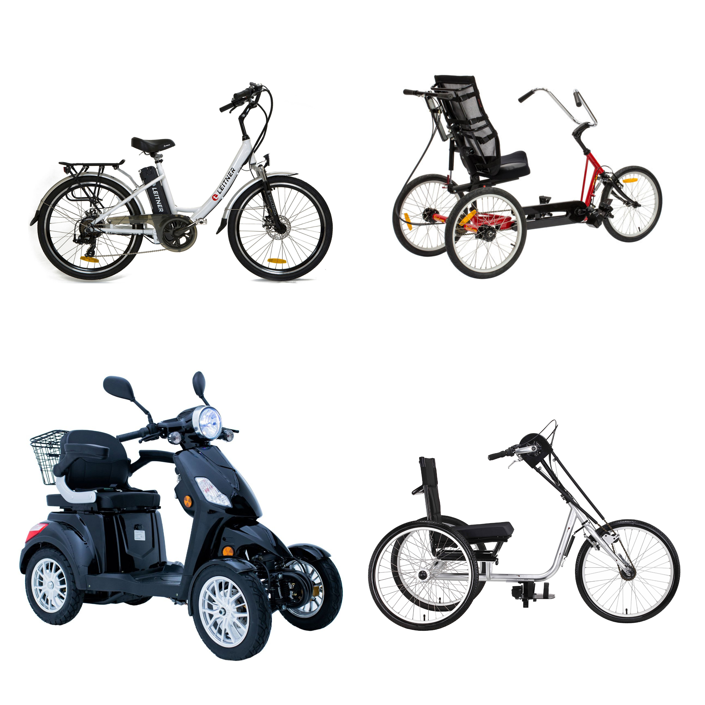

I recently attended a Somerville city council meeting regarding the city's [Bicycle Network Action Plan](https://www.somervillema.gov/content/somerville-bicycle-network-plan). After city council members presented details on the plan, there was time for public comment. Many residents spoke in favor, many against. A recurring theme among those opposed to bike lane expansion was appeals to accessibility:

_Sure, bikes are fine for young and healthy people. But what about the elderly and disabled? What about my grandma who isn't able to bike? What will become of handicap-accessibility parking spaces in the bike lane building frenzy?_

These concerns are valid, and must be taken seriously. However, the takeaway cannot simply be that cars are the paragon of accessibility and the best we can do to promote freedom of movement is uphold the status quo of car-centric cities. In reality, there are millions of people in the US that are unable to drive due to age, disability, legal status, or financial constraints.

Let's talk kids, for starters. Children under age 15-16 are too young to obtain a learner's permit. But by age ten, many kids are mature enough to begin navigating the world on their own-- either by foot, bus, or bicycle. Kids 10-15 years old represent about [8% of the US population](https://www.neilsberg.com/insights/united-states-population-by-age/), that's about 27 million people. Some kids can start traveling independently much younger than ten years old; see the hit Japanese reality show ["Old Enough!](https://www.imdb.com/title/tt1289730/) in which toddlers complete errands like grocery shopping alone. Fifteen is also a conservative upper-bound, since getting a learner's permit so young requires access to a car and support from a parent or guardian. However you slice it, there are millions of children yearning and deserving of independent mobility for whom driving is not an accessible option.

On the other end of the spectrum we have the elderly. [According to the CDC](https://www.cdc.gov/older-adult-drivers/about/index.html), "drivers aged 70+ have higher crash death rates per 1,000 crashes than middle-aged drivers (aged 35-54)." There is no hard cutoff for when someone is too old to drive, but many elderly people will voluntarily stop driving due to declining vision, hearing, and cognitive abilities. Others will be forced to stop after a collision, hopefully not a fatal one.

In between the young and the old, we find many millions more unable to drive.

Regarding dis(ability): certainly, some bodies are able to drive but not bike, but the reverse is also true. An individual may be **unable** to obtain a driver's license due to impaired vision, neurological disorders like epilepsy or narcolepsy, cognitive disabilities like Alzheimer's, physical disabilities like loss of limbs, or developmental disabilities like autism. Not all, but many folks described by this list may find biking to be a viable alternative. Especially when we consider e-bikes, hand-cycles, adaptive tricycles, and other wheeled transportation including wheelchairs and powered mobility scooters. With proper infrastucture, these modes can provide a safe, independent, and dignified travel experience.

In addition to all the people already mentioned, others unable to drive include:

- People lacking documentation or legal status
- People who cannot afford a car, insurance, gas, and maintenance
- People who had their license revoked due to a DUI or other offense

There is no question that accessibility must be taken seriously when planning city streets, and amenities like handicap parking cannot be removed without ensuring the needs of those who rely on them are met. However, I reject appeals to maintain the status quo in the name of accessibility. These arguments are insufficiently examined, or occasionally even made in bad faith.

Cars are not accessible to tens of millions of Americans, who deserve alternatives that are safe, convenient, and dignified. Bike infrastructure is a start.
