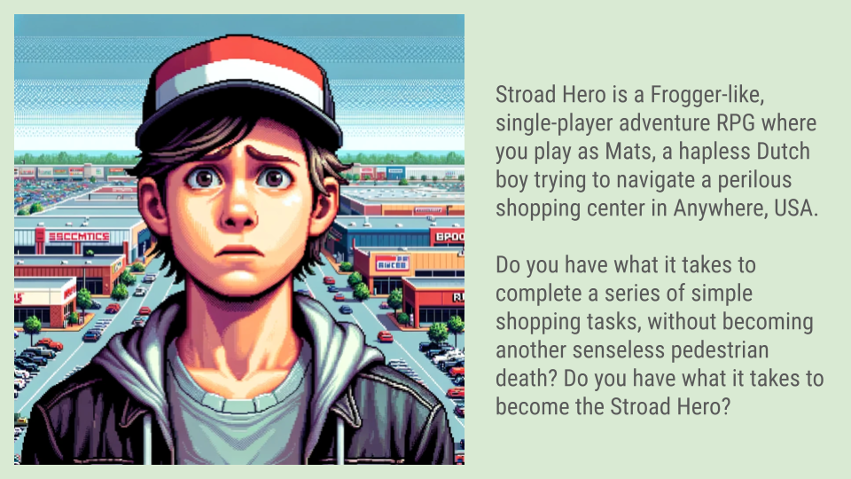

For the past month or so I have been working on a little activist video game called "Stroad Hero." I'm using the Godot game engine, and the code is [on GitHub](https://github.com/dustinmichels/stroad-hero). It's far from finished, but here's a write-up about how it started and how it's going.

---

While my partner and I were attending to family matters in Muncie, Indiana, we stayed in a hotel that was laughably difficult to reach by foot.

The hotel was embedded within a sprawling shopping area that stretched along a major roadway. All the staples of American suburban consumerism were present: Walmart, Walgreens, Lowes, BestBuy, PetSmart, Taco Bell, Panda Express, and so on. The major artery was a state road with 4-6 lanes of traffic, but even after you cross that, you still have to navigate a dismal web of massive parking lots and corpulent side roads. Sometimes, you find a sidewalk, but it usually doesn’t lead anywhere. Sometimes, you come to a fence and have to find a new way around.

This type of area is built for cars, not people. If you have the audacity to travel by foot, you will find the experience confusing, tedious, and sometimes dangerous.

As we lamented all the "stroads" you have to dart across to reach your destination, I began envisioning a Frogger-esque video game called "Stroad Hero."

## What is a stroad?

"Stroad" is a term I learned from a ["Not Just Bikes" YouTube video](https://youtu.be/ORzNZUeUHAM?si=UFjHQrRxeFrD4NAe) to describe an abundant and unholy type of thoroughfare-- a road/street hybrid that disastrously muddles the design principles of each.

The idea is that traffic planners (especially in countries like the Netherlands) often clearly distinguish between a road and a street.

- **A road** is expressly for moving cars quickly and safely _between_ destinations. To accommodate the high speeds, lanes should be wide and forgiving, the curves gradual or even banked, and the margins clear of deadly obstacles like big trees. You want to minimize stopping. In the case of a highway, you have onramps and offramps instead of intersections.

- **A street** is for moving cars, bikes, and people around _within_ a destination, such as a neighborhood or a city center. Here, cars are constantly slowing down to turn, park, or yield to pedestrians, so speeds need to be low. Low speeds can be encouraged by making streets narrow and winding and featuring obstructions that compel drivers to take it easy.

However, what you find all over America is the "stroad." It has many features of a road, like wide, straight lanes for moving cars along as fast as possible. But it is _also_ a destination where drivers constantly need to slow, turn, park, and get out of their cars.

Everything about the design indicates you should be able to drive really fast, but you can’t. You must be on the lookout for turning cars and intersections and people.

Stroads are full of these annoying contradictions and ironic oddities. For example, you might see a wide margin devoid of trees or any obstacles a car could collide with (as dictated by road design principles), but then a bike lane or sidewalk is haphazardly tossed into that same margin!

The "Not Just Bikes" video also states that these places can feel unsettling to traverse on foot since they are built to highway scale, not human scale. You encounter the looming jumbo signs needed to attract the attention of a fast-moving motorist, which feel uncanny once you step outside the car.

This was definitely the case in that Muncie shopping area.

## Stroad Hero

### Concept

The initial idea was to create a simple, 2D, pixel-art-based ode to [Frogger](https://en.wikipedia.org/wiki/Frogger), where you try to cross a stroad without getting smushed. It would be an activist game about street safety.

<!--  -->

As I chatted with friends, more narrative elements quickly developed. I decided you should play as Mats, a hapless Dutch boy trying to navigate a perilous shopping center in Anywhere, USA. I thought the tagline could be: "Do you have what it takes to complete a series of simple shopping tasks without becoming another senseless pedestrian death? Do you have what it takes to become the Stroad Hero?"

I imagined that Mats and his mother had recently moved to the US from the Netherlands, where children can more safely get around and complete basic tasks with autonomy. Each day, his mother gives him a list of errands to complete. They are both unaware of how challenging this will be.

I envisioned an "SPD" counter in the top right corner (for senseless pedestrian deaths), which increases each time Mats gets crushed. And an "errands completed" counter, too.

I wanted the player to feel revulsion at little Mats getting crushed repeatedly. I also wanted to capture the frustration of wandering endlessly through a sprawling and confusing environment. I wanted to include humor as well, in part through parody. I imagined spoofing all the shops' names and logos, like "TacoHell" and "WalGroins," for instance.

And then the game should be fun, too. I thought the fun could come from _becoming_ the Stroad Hero-- from achieving mastery over this daunting environment. Not only does the player learn to move without getting hit, but she could also unlock new tools to make movement easier. Like a skateboard or a hammer she could wave at motorists to make them stop.

But is that the right message? That you can "win" by mastering this environment? In an alternative concept, there are other pedestrians besides you getting killed, and their deaths also augment the SPD counter. No matter how trained your own movement becomes, you still lose in the end. The only way to win is to change the built environment. Perhaps you can sneak out at night to paint crosswalks where they are lacking. Or somehow lobby the city council to redo the street?? Via a fun mini game??

### Progress

I have never done game development before, so there was a big learning curve! I used the open-source game engine [Godot](https://godotengine.org/) and walked through a few tutorials. I also bought some cute pixel art on [itch.io](https://limezu.itch.io/modernexteriors), which was a great help.

Some of my loftier goals had to wait, but I was able to produce a basic proof-of-concept.

There are no shops yet; thus, no shopping list. But there is a Mats to control and a stroad to cross. There are cars that crush, and there are flags to capture as placeholders for the errands. There is a running count for errands completed and "SPD" (senseless pedestrian deaths) in the top right.

There are some basic sound effects. When Mats gets crushed, a blood stain is left on the road, which gradually fades away. I also added a feature my roommate suggested: upon death, Mats drops the most recently collected flag, and you have to go back to retrieve it.



If you want to try it out, you should be able to download and run it on macOS and Windows, [here](https://github.com/dustinmichels/stroad-hero/releases/tag/v0.1.1). Feel free to add an "issue" on GitHub if you encounter any problems.

### Next steps

I have some big dreams about the game's future: an expansive world, side characters, minigames, new skills and items to unlock, an inspiring narrative about revolution, and fun pixel-art cutscenes like those in [Dave the Diver](https://youtu.be/X2jycKy16qo?si=-4KmkOMukIDy02i0).

With my limited skill level, some of that may have to wait.

I think some immediate next steps would be:

1. Continue to build out the stroad environment with shops and parking lots.
2. Replace the flags with specific errands.
3. Increase the intelligence of the cars so they can turn and park, not just drive straight.

Stay tuned!
