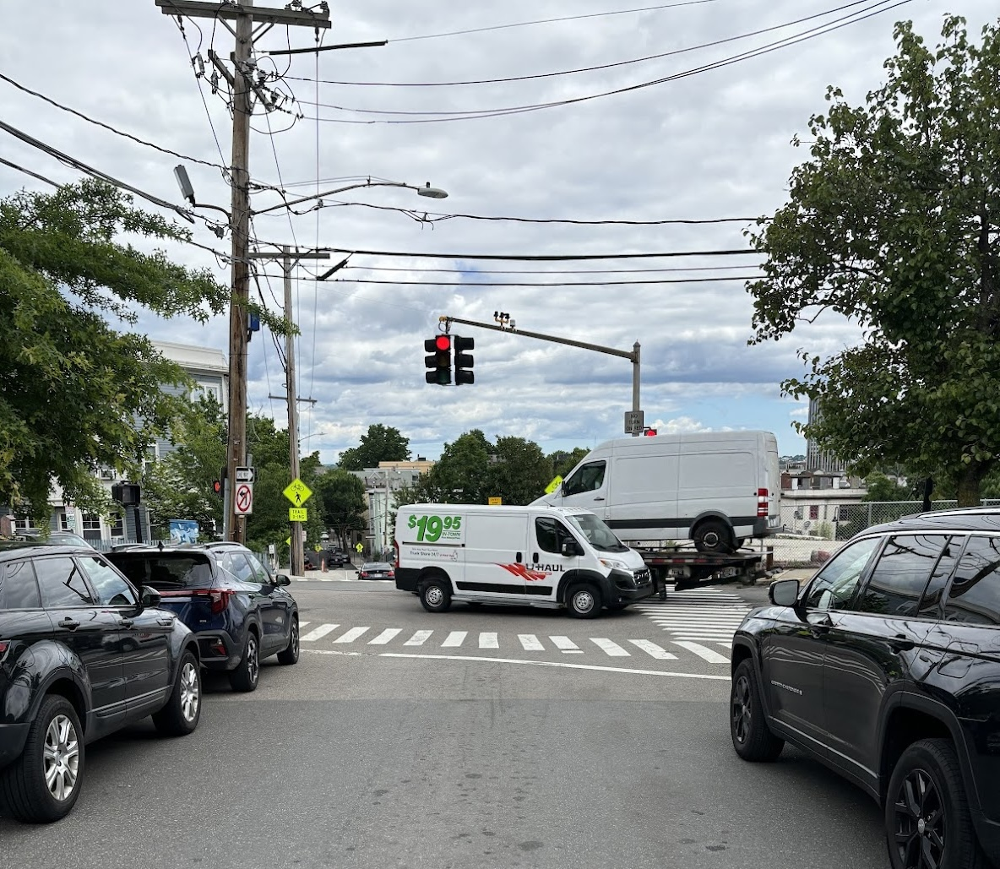
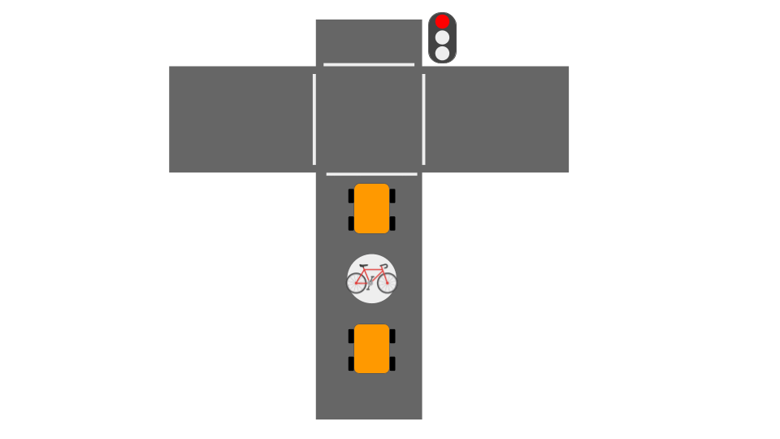
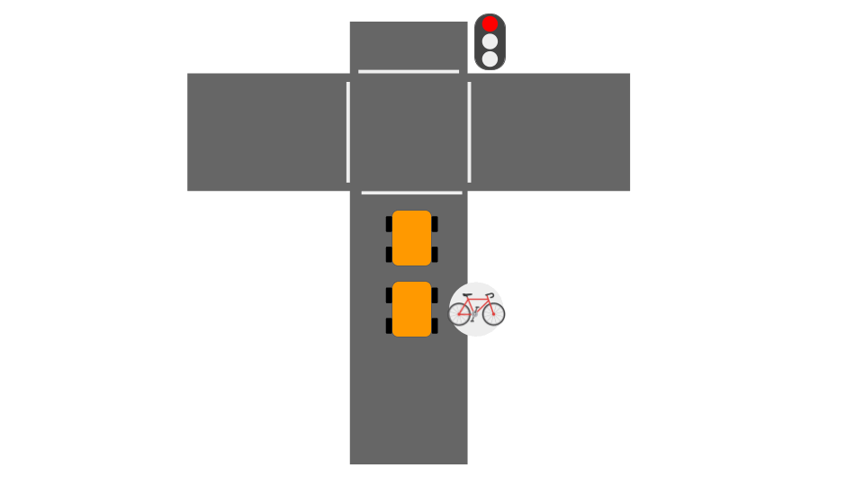
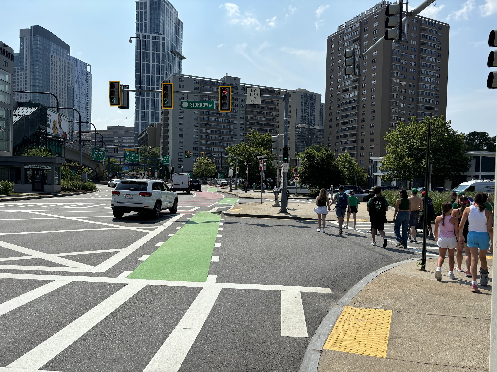
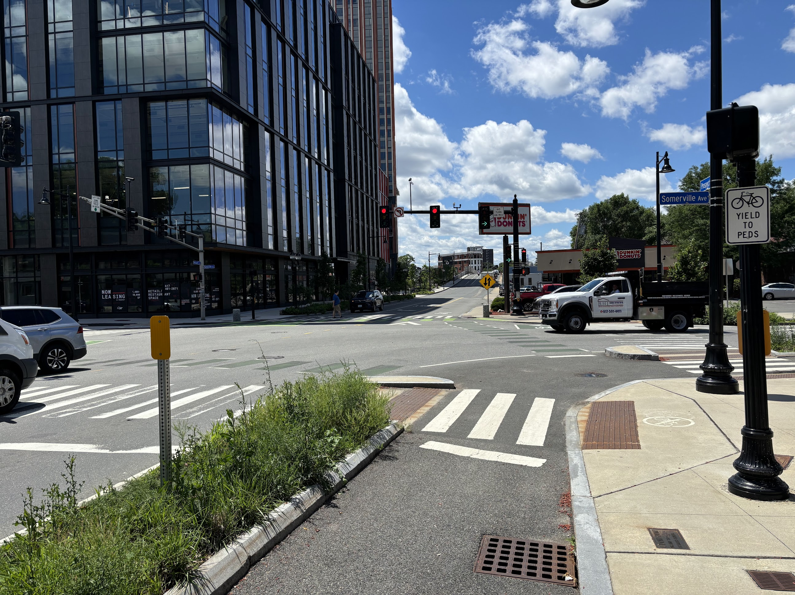

A growing number of states have legalized the "Idaho Stop," which allows cyclists to treat red lights like stop signs, [citing safety benefits](https://usa.streetsblog.org/2022/10/20/fed-safety-administrator-lets-legalize-the-idaho-stop).

Whether it’s legal or not, this behavior drives drivers crazy. Judging from comments I see online and occasionally shouted out of car windows, motorists hate when cyclists run red lights. They see it as reckless, chaotic, and, worst of all, unfair.

True, I have seen cyclists run red lights recklessly. But many cyclists, including myself, will slow or stop at a red light and check that the coast is clear before, occasionally, deciding to pick their way across an intersection. I want to explain why this behavior is not simply about 'skipping the line.' Rather, in an urban environment built for cars, it is often the safest thing to do.

## Intersections are dangerous

Intersections are dangerous for everyone, but bikes are especially vulnerable. An inconvenient collision for a motorist could be a fatal crash for a cyclist.

At a typical red light, in a typical US city, there are no particularly safe options-- just a selection of varyingly bad ones. These options include:

1. Wait _in traffic_ like a car
2. Wait _alongside_ cars
3. Wait _in front_ of the cars

Here is a Somerville intersection I frequently cross:

No bike lane, no turn lane. Imagine you pull up on a bike when the light is red, and a couple of cars are already stopped.

### Option 1: Wait in traffic like a car

This sometimes feels like the "polite" thing to do-- act like a car and don’t skip the line. Don’t pass cars that may just pass you again after the light turns green.

One risk is that if the car behind you gets forcefully rear-ended, it will smash into the car in front, and you will get smooshed between them before you have time to react.

Another downside of this approach is that once the light turns green, you feel a lot of pressure to _go go go_. With cars moving ahead and behind you, you limit your ability to verify that the coast is clear and react to issues like a driver running a red light.

### Option 2: Wait alongside cars

To avoid the smoosh zone and stay outside the flow of car traffic, you could position yourself to the right of the cars, working your way up the non-existent (or existent) bike lane.

The issue here is you sacrifice your visibility. Cars may not notice you creeping up the right-hand side, and when the light turns green, you could easily be struck by a vehicle turning right.

### Option 3: Wait in front of cars

To fix the visibility issue, you could wait directly in front of all the stopped cars. This behavior is sometimes encouraged by a ["bike box,"](https://nacto.org/publication/urban-bikeway-design-guide/intersection-treatments/bike-boxes/) a painted area in front of the cars that is reserved for bikes.

This is often the right strategy for safely crossing an intersection. The problem is what happens _after_ the intersection. Now you have a long line of impatient cars behind you that want to pass as soon as possible.

Each car narrowly zooming past presents a safety hazard. Plus, this situation can be intimidating for cyclists, making them unsure of what to do, leading to unpredictable behavior.

### Option 4: Just run the red light!!

None of the above options are very good, and I've only considered the basic scenario where the cyclist is going straight! Things get even more complicated if you want to make a left turn.

The alternative is to make your way to the front of the line, look both ways, and cross if clear. In doing this, you:

- Mitigate the risk of getting squished between cars in a rear-ending incident.
- Mitigate the risk of getting right-hooked on green.
- Put some space between you and the waiting cars, so they are not all bearing down on you as soon as you get across the intersection.

In many scenarios, this is absolutely the safest thing to do.

## Infrastructure can help

Lacking dedicated infrastructure, cyclists must take responsibility for their own risk.

At every intersection I come across I am considering a multitude of factors to decide what to do. _Do I have time to get to the front where I am visible before the light turns green and cars start moving, or am I better off waiting back here in traffic? Hmm. How long has the light been red? How many cars do I need to pass? How much space is there on the right?_

It can be cognitively taxing. I remember biking with my friend Jan in Kiel, Germany, and realizing after a while how unusually relaxed I felt. I had so little to think about since almost every intersection had dedicated and consistent infrastructure for cyclists. You can just follow the design that is laid out for you.

Here's an intersection in downtown Boston that I feel pretty happy about:

There's a dedicated bike lane, a dedicated bike signal, and (crucially) a dedicated right turn signal. When the bike symbol is green, the right turn signal is red; when the turn signal is green the bike light is red.

This solves all the problems I mentioned above. I have no qualms about waiting at a red light. If cops want to ticket cyclists who run this particular light, that's fine with me.

However, some ostensibly modern infrastructure still doesn't cut it.

There's an awfully strange intersection near me (Somerville Ave & Prospect) which boasts a bike signal and right turn signal, BUT the bike lane vanishes on the other side of the intersection. So, if you obey the signals, you have to merge into traffic in the middle of the intersection.

This is a particularly long light, so you inevitably must contend with a long line of cars eager to gun it as soon as the light turns green.

If I get a chance, I prefer to dart across on a red light, when the coast is clear, and turn onto the side street up ahead to get out of the way.

This is just to say: infrastructure that addresses 70% of my safety concerns is not good enough. I still need to be responsible for my own safety, and sometimes that means running a red light.
