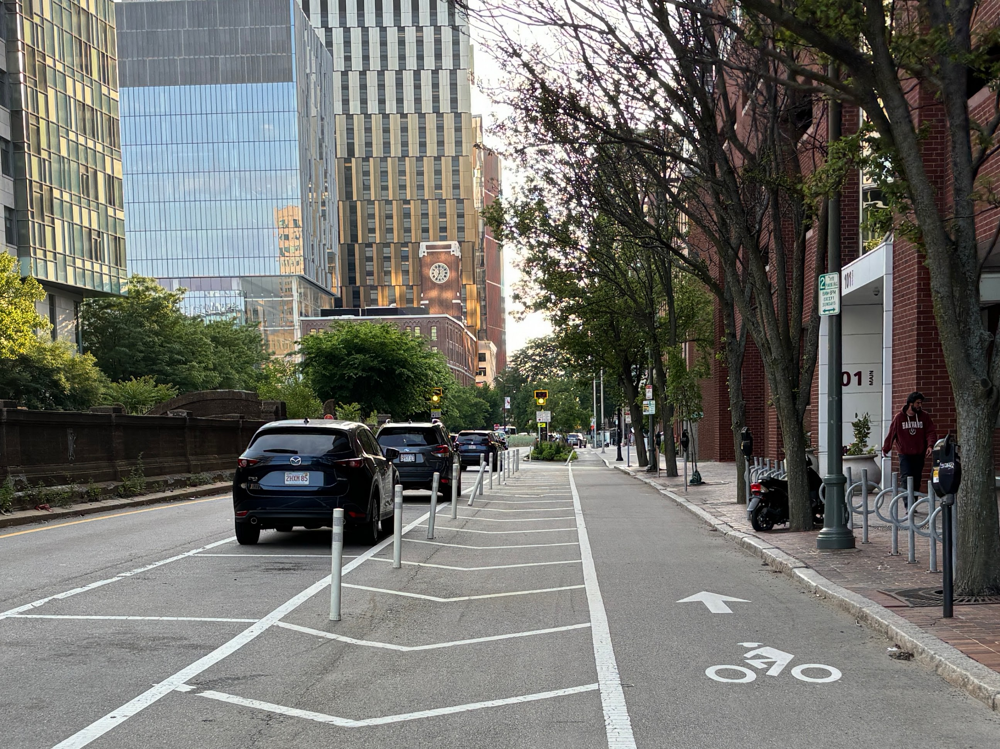
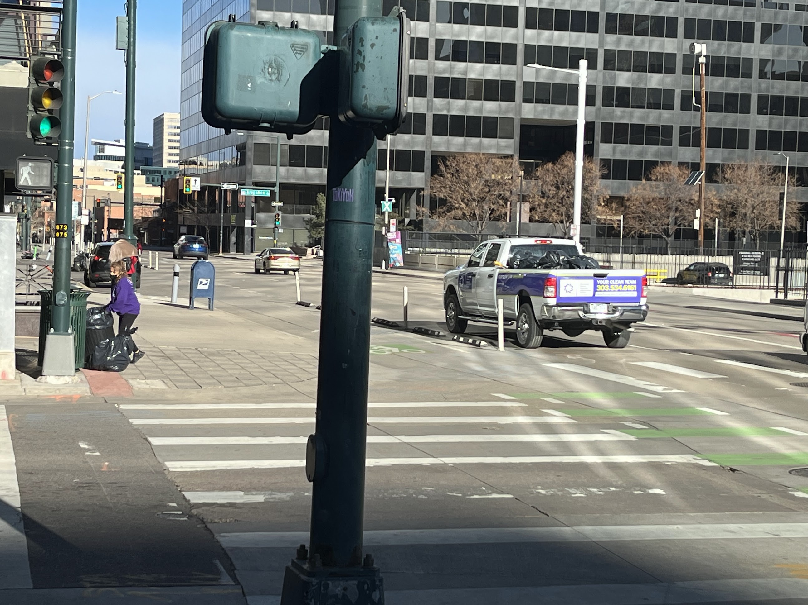

While commuting down Washington Street this morning, I encountered an Eversource electrical truck protruding into the bike lane. Though this seemed like a reasonable blockage, I still murmured something under my breath about how _there is always shit in the bike lane_ and glanced over my left shoulder, preparing to merge into bustling traffic.

Then, I realized the workers had actually created a path of cones, preserving the lost bike lane and sidewalk while closing down one lane to car traffic. Unprecedented! Remarkable!

I looped back to snap a picture and shouted to a worker who was eyeing me that I felt so grateful and loved. He shouted back, "I’ll set it up for you tomorrow, too!" [[See tweet.]](https://twitter.com/Dustin_Michels/status/1800918461406687623). What a rare delight.

## Blocked lanes

In the city, blocked bike lanes are a daily nuisance for cyclists. Delivery trucks, moving trucks, and service vehicles all wind up sitting in the bike lane with their blinkers on. Then you have parents, taxi drivers, and take-out aficionados conducting pick-ups and drop-offs.

Oftentimes, I don’t mind. City streets are crowded and places that must support a multiplicity of needs. Still, the cumulative effect of being _constantly_ ejected from what was ostensibly a dedicated bike lane and thrust into oncoming traffic is to feel stressed out and denigrated, and made less safe[^1].

Some cycling advocates take these obstructions as evidence that paint is inadequate and _protected_ bike infrastructure is needed. Block the lane off with something real and hard, like concrete planters. Even a row of parked cars can be good, provided you have enough space for opening doors.

Laws, protocols, and trainings can help, too. For example, in Denver I was delighted to see a municipal trash truck pause in a redundant car lane instead of the singular bike lane.

## Contentious curbs

The real issue, though, is not figuring out how can we possibly keep cars out of bike lanes. The bigger problem is that space is a hot commodity in the city. Curb space especially so.

That precious sliver of land on the side of a street has numerous potential uses, including:

- Street parking
- Loading/unloading zone
- Bus stop
- Bike lane
- Bike share / scooter docking station
- Outdoor dining structures
- Beautification (trees / plants)
- Sidewalk improvement
- Electric vehicle charging station

When space is limited, we must chose.

I know there has been some discussion of smart / dynamic curbs[^2]. There are companies and cities interested in using technology to better understand which curb uses should be prioritized in different places, and potentially creating curbs that can alter their use throughout the day.

I think what is being envisioned is something high-tech and faraway in the future, like curb areas that physically move or are illuminated differently at different times. But we are already familiar with low-tech implementations. Signs that say “no parking this side first Tuesday of the month for street sweeping,” for example.

In practice, many bike lanes are treated as de-facto dynamic curbs. They are curb space allocated for bikes unless anyone else wants to use that space for anything, and then they magically transform!

While often annoying, this type of flexibility may sometimes be necessary. The bike path of cones, however, is an excellent, low-effort way to make that dynamic alteration more smooth, safe, and explicit. I would love to see more of it.

[^1]: In a famous (now 13-year-old) [YouTube video](https://youtu.be/bzE-IMaegzQ?si=6Af50Itkot9GJ0I9), Casey Neistat responds to the absurdity of being ticketed for _not_ riding in the bike lane in NYC by attempting to follow the law; he proceeds to crash his bike (with great commitment) into a non-stop barrage of obstacles, including a cop car.

[^2]: See: ["Can Technology Help Cities Manage Curbs Better?", NY Times.](https://www.nytimes.com/2022/08/24/business/curbside-management-cities-technology.html)
