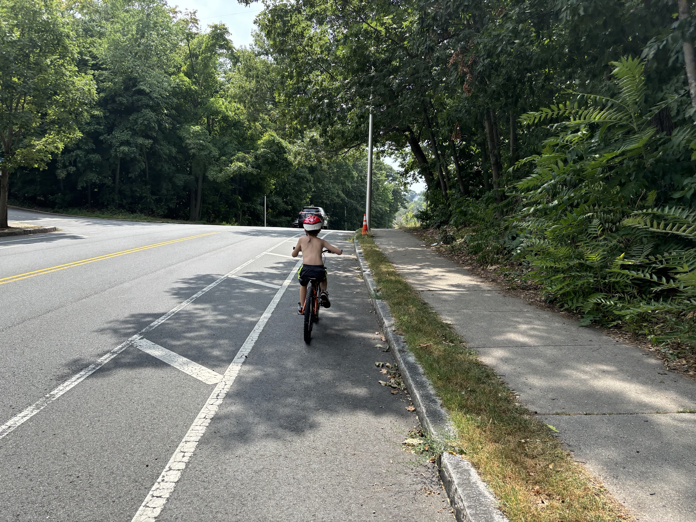

When I arrive at the Medford home of J, my 11-year-old “Little” through the Big Brother Big Sister (BBBS) program, he’s usually waiting for me on the front porch with his bike helmet on, ready for another adventure. We’ve biked together to parks, movie theaters, climbing walls, and ice cream shops. We’ve carried our bikes onto trains and boats, amplifying our range across Somerville, downtown Boston, and Roxbury. While venturing to a local swimming spot last summer, we came to a playground less than ten minutes from his home. “I’ve always wanted to go here,” he said longingly. “Let’s check it out!” I replied. How unusual for him, accustomed to being a helpless passenger. We wound up stopping at every park on the way to the lake. Perhaps for the first time, he was in the driver’s seat.

The bicycle represents different kinds of freedom for different people. As a high-schooler, biking helped me manage anxiety about impending climate catastrophe. A strong body and a clear mind were serendipitous, auxiliary benefits. For Nouran, a Musilim woman living in Cairo, biking represents something different: financial independence, a reprieve from traffic, and a way to refute sexist expectations about proper womanly conduct.[^1] For J, and other children like him, the bike offers a breath of autonomy- a chance to experience his environment on his own terms. Without it, he depends entirely on a working mother with health issues and frequent car troubles to mediate any interaction with the outside world. Is it any wonder he stays home so often, playing video games alone-- understimulated, undersocialized, lacking basic motor skills, and with only the vaguest sense of what his community looks like and what it has to offer?

The bicycle is not some meager toy for recreation; it is among the most powerful technologies we have for combating climate change, while promoting physical, social, economic, and emotional wellbeing. I have been a longtime bicycle advocate for these reasons, and helping kids explore and develop through cycling is especially meaningful to me. But I also know the urban streetscape cyclists face can be dismal and dangerous, let alone little cyclists with underdeveloped powers of perception. Three bikers have been killed this year in Cambridge alone. Every time I convince someone to try biking, some part of me worries I'm sending them to an early

The bicycle is not some meager toy for recreation; it is among the most powerful technologies we have for combating climate change, while promoting physical, social, economic, and emotional wellbeing. Helping kids explore and develop through cycling is especially rewarding to me. But I also know the urban streetscape cyclists face can be dismal and dangerous, let alone little cyclists with underdeveloped powers of perception. Three bikers have been killed this year in Cambridge alone. Every time I convince someone to try biking, some part of me worries I’m sending them to an early grave.

That sense of empowerment is a vital and scarce commodity for children today. Anxiety and depression are on the rise for adolescents, especially since the pandemic, and Stephanie Murray suggests that a loss of independent, unsupervised time-- in which kids gain confidence about their ability to navigate the world and solve their own problems-- may be a key factor. For J, and other children like him, the bike offers a breath of autonomy, a chance to experience his environment on his own terms. Without it, he depends entirely on a working mother with health issues and frequent car troubles to mediate any interaction with the outside world. Is it any wonder he stays home so often, playing video games alone-- understimulated, undersocialized, lacking basic motor skills, and with only the vaguest sense of what his community looks like and what it has to offer?

[^1]
