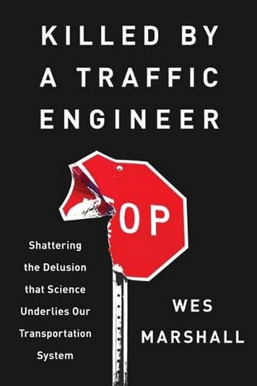

I've been reading the book "Killed by a Traffic Engineer" by Wes Marshall. I find it to be a very thoughtful, well-researched and well-argued critique of the myths that underpin modern road design and where they come from and why they are wrong.

The key argument of the book is that traffic "engineering" is different from other forms of engineering because you must manage human behavior, not just objects that follow physical laws. Traffic planners mistakenly borrow assumptions from other engineering disciplines, leading to counterproductive safety interventions that can actually make roads more dangerous.

For example, if you are a civil engineer building a bridge you might first calculate the load you expect the bridge to bear, then add a safety factor. You want to ensure the bridge can withstand an abnormally high load. Making the bridge _stronger than necessary_ makes it safer and more resilient to unexpected events.

A traffic engineer might want to do the same thing with car speeds. You expect the cars to drive 30mph since that is the posted speed limit, but _just in case_ someone is speeding you want to ensure the road doesn't cause them to crash. So you design the road to be wide and straight, with no obstacles near the edges and no sharp turns. All of that _should_ increase the safety factor, but it doesn't, because it just encourages people to drive faster.

Every chapter explores different variations of this problem: road safety policies and practices that intuitively make sense but wind up making things worse. In one chapter, Marshall discusses and Colorado Department of Transportation (CDOT) policy that requires periodically repainting lane lines on highways, since surely bright, visible lines will help people drive safely, especially in the mountains and in snowy conditions. Marshall says the efficacy of this expensive practice has actually not been studied sufficiently, but the limited research that _does exist_ suggests that when lines are less visible drivers slow down and pay more attention, improving safety outcomes.

It's the same story over and over. The best thing you can do to improve road safety is force drivers to drive slowly and pay attention, and the best way to do that is generally to make roads _less_ "safe" by adding obstacles, reducing visibility, and otherwise adding friction.

I don't think it's discussed in the book but I know another famous example of this is ["Dagen H"](https://en.wikipedia.org/wiki/Dagen_H), when Sweden switched from driving on the left side of the road to the right side in 1967. Many were concerned that the chaos and confusion of the change would lead to record high crashes, but in fact the number of collisions was lower than usual. Why? Because attentiveness and caution were high.

> _Unsafe conditions make for safe drivers. Safe conditions make for dangerous drivers._

## Problems of measurement

In endeavoring to explain where these incorrect notions about traffic safety come from and why they persist, the author gets into some interesting problems of measurement.

For example, he talks about about the fact that historically data collected about road safety lumped all collisions together-- small fender benders and fatal crashes all get counted the same. Some planners even made the assumption that little crashes were predictive of big crashes, borrowing from a common belief held about factory incidents (the idea that if you have a lot of small accidents that implies a culture of recklessness and you are bound to have a big incident soon).

The problem is that when it comes to road safety, the relationship may actually be _inverse_ rather than direct. On streets that are narrow and complicated, where drivers must be attentive and cautious, you might occasionally get fender benders but you are unlikely to get fatal crashes. On wide, straight roads where drivers can zone out and speed, and even drift out of their lane a little without hitting anything, there may be fewer collisions overall but when a crash does happen it is more likely to be catastrophic, resulting in serious injury or death.

The author argues that what we as a society really want to avoid are the catastrophic crashes, even at the cost of more minor incident. To accomplish this requires collecting data more carefully and tailoring interventions to reduce _major_ crashes, not _all_ crashes.

Another problem is that when we make data-driven assessments of road safety we may fail to take a wholistic view of the entire land use and mobility picture. The author discusses the example where you have:

- City A: Dense, urban, has many places of work. Many residents walk, bike, or use transit to get around.
- Town B: Low density suburban housing with very few jobs. Everyone drives to work.

In Town B, perhaps the streets are wide and forgiving and the number of accidents are low (perhaps because there are few people and not much goes on there.) In City A, where the streets are more narrow and complicated, perhaps the number of accidents are higher. This data could lead a planner to conclude the road design in Town B is superior and should be emulated elsewhere. However, this misses the reality that many of the collisions occurring in City A are caused _by commuters from Town B_ who are driving in to work. Thus, the planning choices made in Town B (creating a car-centric area with few jobs) are a root cause of the collisions, but when data is collected, all the blame can fall on City A where the collisions occurred. In fact, the planning choices in City A which allow many residents to avoid driving all together may make for fairly safe streets, but that achievement is not properly reflected in the data.

## Conclusion

Killed by a Traffic Engineer by Wes Marshall is a powerful and persuasive critique of the misguided principles that underlie much of modern road design. The book does an excellent job of challenging the assumptions we often take for granted about what makes roads safer, revealing the unintended consequences of interventions that prioritize engineering logic over human behavior. To me, the key argument is that true safety comes not from trying to prevent any collision from happening but from introducing complexity that makes drivers more attentive and cautious, even at the cost of occasional minor collisions.
