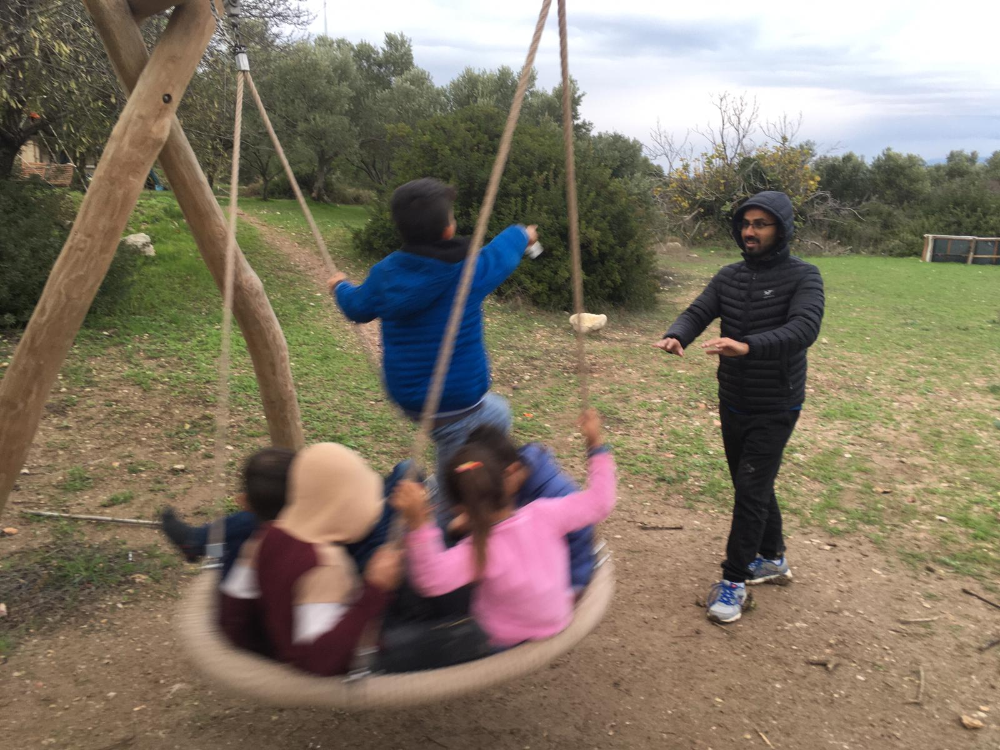

While having dinner with friends, I got excited about the idea of playgrounds as little microcosms of cities, in which the "[affordances](http://www.jstor.org/stable/41427809)"-- or "action possibilities"-- of the built environment heavily influence the types of activity that take place.[^1] When designing playgrounds, as with cities, we must think carefully about how to create spaces that encourage and facilitate desirable interactions.

For example, let's talk about swings.

A classic swing is good for a parent to push a young child, promoting parent-child bonding.

[_Stock photo from [istockphoto.com](https://www.istockphoto.com/photos/parent-pushing-kid-on-swing)._]

If this were an explicit goal, one could even install a ["generation swing"](https://leaparkandplay.com/product/generation-swing) that lets a parent and child swing face-to-face.

Slightly older children might engage in jumping competitions, or challenge each other to swing as high as possible during recess, honing physical aptitudes while socializing.

Even older children might swing besides one another while chatting, once again using the space to deepen a pair bond. A swing set could provide a suitable place for adolescents to engage in challenging conversations or grow a budding romance. Why? The swing set lets you converse with a partner, in a neutral, public space, where the distraction of swinging and the lack of eye contact lessen the intensity of the conversation making it easier to broach awkward topics.

Swings and wonderful and powerful tools! But is the swing set a good space for meeting strangers? Not particularly. What if we want children and parents and turn outwards, forming new bonds with others in the playground community?

A large basket swing carries an entirely new set of social norms and possibilities.

Many children can pile onto the basket and share an experience of swinging together. This encourages kids to interact with each other, and potentially, an adult to interact with kids that aren't their own via pushing.

Here's a picture from the [Imece Initiative](https://www.imeceinitiative.com/en/) villiage in Turkey, where I did volunteer work with Syrian kids, and where at basket swing was an endlessly entertaining focal point of play:

_[Imece, Turkey, December, 2019]_

A basket swing is a great use of real-estate and capital, since the footprint is only marginally larger than a classic swing but many children can use it at once.

But the question of which swing to install is largely a philosophical one, about the purpose of the playground: _Is this a place for parents to play with their own children? Or a place for multiple children to meet each other through play together, while parents must cooperate and trust each other with the important jobs like pushing the swing?_

Personally, when it comes to playgrounds and cities alike, I am especially interested in infrastructure that encourages strangers to meet and form bonds, since many Americans and in particular parents and children seem to be suffering from afflictions tied to social isolation.

Much has been written about the loneliness epidemic in the US. In May 2023, Dr. Vivek Murthy released [a Surgeon General Advisory](https://www.hhs.gov/about/news/2023/05/03/new-surgeon-general-advisory-raises-alarm-about-devastating-impact-epidemic-loneliness-isolation-united-states.html) warning of a crisis of loneliness, isolation, and lack of connection in this country, entailing many public health risks to individuals and communities. The report cites a steep decline in-person interactions, accelerated by the covid-19 pandemic, as a major culprit. It warns that "lacking connection can increase the risk for premature death to levels comparable to smoking daily."[^2]

What about children specifically? Children face rising rates of anxiety and clinical depression, amounting to [a national emergency](https://www.npr.org/2021/10/20/1047624943/pediatricians-call-mental-health-crisis-among-kids-a-national-emergency). Anxiety and depression are [strongly associated with social isolation](https://pubmed.ncbi.nlm.nih.gov/34614137/).

And what about parents? According to [Pew research](https://www.pewresearch.org/social-trends/2023/01/24/parenting-in-america-today/), most parents say being a parent has been harder than they expected. Many are tired and stressed.

The US is a land where insular, nuclear families reign supreme, and where paranoia about 'stranger danger' runs high, yet parents frequently complain about the loneliness and difficulty of raising children without a so-called "village."

This is to say: while a loneliness epidemic claws across America, many parents seem interested in cultivating community bonds that can provide support and socialization for themselves and their children, and many children would likely benefit greatly from increased social interaction.

Can parks and playgrounds play a role in addressing these issues? Probably!

The surgeon general advisory specifically recommends strengthening "social infrastructure", including parks and libraries as a solution.

However, not all playgrounds are created equal. Different amenities afford different types of play and social interaction.[^2]

When families come to a playground, do parents sit on their phones while children play independently? Do parents play one-on-one with their own children? Or do parents and children play together with others, forming new bonds in a way that models healthy social connection and potentially even creates relationships that extend beyond the playground? There is a place for all of these, but the last one seems the most elusive unless careful thought is put into the design of the playground.

The basket swing is one technology I see that invites intergenerational play beyond pre-existing relationships.

At a park I frequently visit with my "little" from the [Big Brother Big Sister](https://www.bbbs.org/) program, I see another. There's a giant carousel that children can climb on which spins in circles, but it's heavy enough that a young child struggles to push it alone. This invites children to work together or enlist the help of an adult-- any adult.

In playgrounds, cooperative, community-building play can be encouraged by design. You can almost trick kids and caregivers into _having_ to meet each other in order to maximize the toys at their disposal.

In cities, the situation is different but not so different. We don't necessarily want to trick adults into playing with each other, but we do want to invite spontaneous social interaction and relationship building through design. Walkable neighborhoods, dog parks, and community gardens can serve these purposes.

It's fun to think about "tricking" anti-social American adults into meeting and cooperating with each other through design.

I visited a Brazilian pastelaria here in Somerville, where a woman asked to share my table. She turned out to be a researcher studying, believe it or not, "Brazilian restaurants in Somerville." She explained that places like this pastelaria are interesting because they are little pockets of the city that adhere to and enforce Brazilian social norms. For example, sharing tables with strangers. She said if we were in an American restaurant she might not have asked to share my table, but in this space I would have to adapt to Brazilian rules.

Outside of a Brazilian pastelaria, what type of design could disrupt an American's shyness about sharing a table, and indicate it's okay to share a table with a stranger? Would such an intervention help combat the loneliness epidemic?

Getting lonely Americans to learn to make friends again seems like a daunting task. But perhaps playgrounds, built to encourage new relationships, are a good place to start.

[^1]: In "A Process Framework of Affordances in Design," Udo Kannengiesser and John S. Gero define "afforances" as "the action possibilities of a user when the user interacts with an artifact." They add "They can be 'directly' perceived, based on the structural features of the artifact. This understanding has the advantage that users do not need to be provided explicit instructions about how to use the artifact." Design Issues 28, no. 1 (2012): 50–62. http://www.jstor.org/stable/41427809.

[^2]: See: [HHS press release](https://www.hhs.gov/about/news/2023/05/03/new-surgeon-general-advisory-raises-alarm-about-devastating-impact-epidemic-loneliness-isolation-united-states.html)
