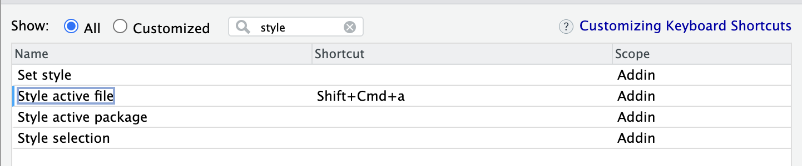

I am a big fan of autoformatting code with a language-specific tool.

This removes all the mental overhead of choosing how to style things nicely, and ensures styling is consistent across a project, usually while also bringing your code into compliance with a popular style guide (like [PEP8](https://peps.python.org/pep-0008/) for Python.) This is especially important if you are collaborating with others. Instead of mixing styles or having to police each others styles in pull requests or (worst of all) fighting over styles and changing things back and forth, you each run your code through the same formatting tool and everything comes out looking the same.

For Python, I usually use ["Black: The Uncompromising Code Formatter"](https://black.readthedocs.io/en/stable/index.html), which has the great tagline "any color you like" (_implied_: as long as it's black.) For JavaScript I use [Prettier](https://prettier.io/) (which also formats html, css, and markdown.) These tools are both descried "opinionated" code formatters-- they go beyond the base requirements of the style guide to deterministically, paternalistically format your code in a consistent way. Which I like.

When using my usual code editor (VSCode), these packages can be installed as extensions, and you can configure the editor to auto format on save. (See: [tutorial](https://www.digitalocean.com/community/tutorials/how-to-format-code-with-prettier-in-visual-studio-code)).

Nice! 👍

## Troubles with R

I have been learning R recently, by auditing the course "Applied Data Science for Cities" at MIT. I had some trouble replicating this "format on save" functionality in RStudio.

In RStudio, there is a built-in autoformatter, which can be run by highlighting the code you want to format and then pressing <kbd>Cmd</kbd> + <kbd>Shift</kbd> + <kbd>A</kbd>.

This is not quite as convenient. For a plain R document it's okay-- you first select all <kbd>Cmd</kbd> + <kbd>A</kbd> and then run the formatter. But for an R Markdown or Quarto document you have to carefully select just the chunks of R code you want to format, otherwise the formatter will complain about the markdown syntax.

For me, using a formatting tool needs to be effortless and automatic to be effectively integrated into your workflow.

## Solution

There is a package called `styler` that can be used, which adheres to the [tidyverse style guide](https://style.tidyverse.org/).

If you install it, you will see some new commands appear under the "Addins" menu in RStudio.

Next you want to bind the command "style active file" to a [keyboard shortcut](https://support.posit.co/hc/en-us/articles/206382178-Customizing-Keyboard-Shortcuts-in-the-RStudio-IDE). You can do this by going to `Tools > Modify Keyboard Shortcuts...` and then searching for "style active file."

If you could bind this to <kbd>Cmd</kbd>+<kbd>S</kbd> we could achieve "format on save," but doing so overrides the default save command. No good.

So the next best thing, for me, is to bind it to <kbd>Cmd</kbd>+<kbd>Shift</kbd>+<kbd>A</kbd>. This is replaces the default "format selection" command with a better command that formats the entire document and doesn't complain about markdown syntax.

It's not exactly the same, but at least it's a single command that formats the entire document and doesn't get tripped up by markdown syntax. I run this periodically as I go and get great gratification out of watching everything snap into place.
