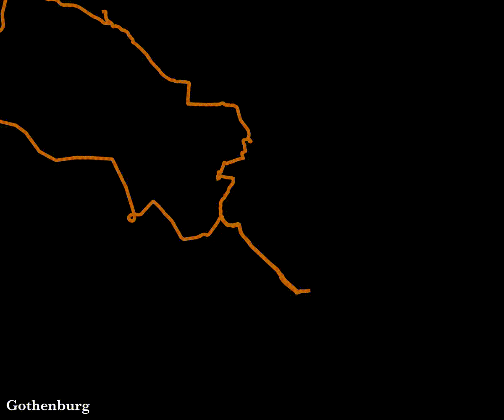
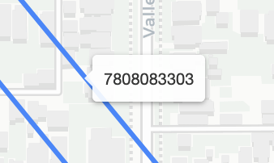
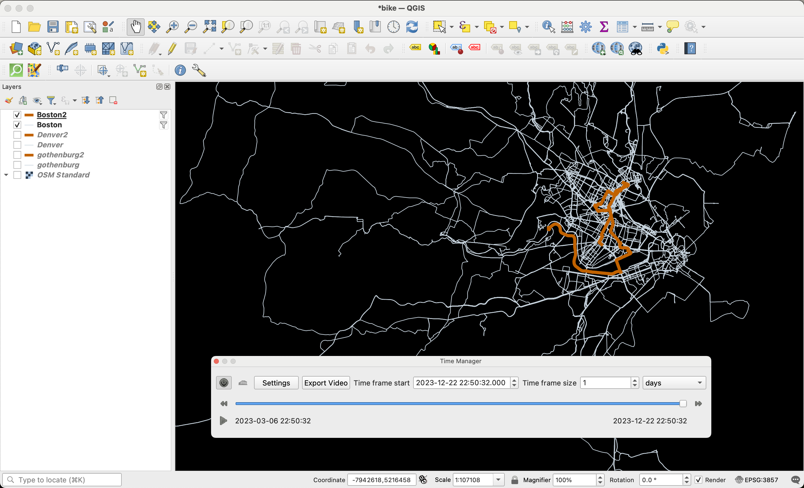

Back in 2020, when I was living in Sweden and (as usual) commuting everywhere by bike I came across a wonderful [animation on reddit](https://www.reddit.com/r/dataisbeautiful/comments/f8nu0c/oc_this_is_how_londons_street_grid_reveals_using/), depicting the poster's five years of biking data in London. Bike routes are added onto a black background one by one in rapid succession, combining to make the street grid of the city legible.

I immediately started recording my own bike rides with Strava. I even took more creative routes to make sure I was padding out the grid, leading me to reflect on [how measurement can influence behavior](/posts/2020/06/strava-and-design-induced-behavior/).

At some point I tried making my own version of the map but got stumped and gave up. Then I moved to Denver. Then I moved to Boston. All the while I've been biking and logging my rides.

I am currently auditing two courses at MIT which deal with spatial data and I've picked up a few useful skills that made me feel ready to try again. And this time I was able to produce some zippy little animations!

- [Results](#results)
  - [Gothenburg](#gothenburg)
  - [Denver](#denver)
  - [Boston](#boston)
- [Why it matters](#why-it-matters)
  - [Future ambitions](#future-ambitions)
- [Procedure](#procedure)
  - [Getting the data](#getting-the-data)
  - [Removing straight lines](#removing-straight-lines)
  - [Making the animations](#making-the-animations)
  - [Potential improvements](#potential-improvements)

## Results

### Gothenburg



- Time range: 2020-04-05 to 2021-04-23 (383 days)
- Num routes: 223
- Total distance: 3,757 miles

### Denver


- Time range: 2021-08-06 to 2022-11-14 (465 days)
- Num routes: 179
- Total distance: 2,605 miles

### Boston


- Time range: 2023-03-06 to 2024-11-15 (619 days)
- Num routes: 300
- Total distance: 5,643 miles

## Why it matters

I think animated maps like these are great for motivating people to explore by bike. The [original post](https://www.reddit.com/r/dataisbeautiful/comments/f8nu0c/oc_this_is_how_londons_street_grid_reveals_using/) I saw certainly had that effect on me.

A more typical (and informative) map would show routes drawn onto a base map, but this more abstract representation puts the emphasis on discovery. There is no world outside of what you uncover through biking. The use of animation (as opposed to, for example, a heatmap of all routes) also emphasizes the idea of discovery. You have to lay down the routes one by one, day by day, slowly _revealing_ the city. It's a process.

In the comment section of the original post, people call out the poster for biking on streets are closed.


It was (and still is) remarkable to me that someone biked enough to draw a complete city map, clearly legible to others.

In every city I have lived in since seeing that post, somewhere in the back of my mind mind this has been a goal of mine-- to bike enough that I could illuminate the whole city with my routes.

### Future ambitions

I would like to expand on this project by creating a reusable tool that others can use to make their own animations like this. Most of the pieces are in place, I would just need to replace the QGIS step with a Python solution, and also create some user interface components for searching for a city of interest, cropping the map, etc. In a web application context, I would most likely use the Strava API instead of relying on users to download and upload their own data.

I would be be interested in building these maps into a larger, interactive data dashboard that lets a user scroll through time and see total number of rides, total distance covered, percent of the city explored, and other metrics increase in sync with the expanding grid of routes. Some of this functionality already exists in other tools, like [wandrer.earth](https://wandrer.earth/).

## Procedure

More detailed information can be found [on GitHub](https://github.com/dustinmichels/bike-exploration) but here's the general idea.

### Getting the data

You can request to bulk download your data from Strava. They email you the whole dossier, including an `activities.csv` and an activities folder full of gpx and other data files for each activity. Here is a subset of columns from the `activities.csv` file.

| Activity ID | Activity Date            | Activity Type | Activity Name | Distance | Filename                  |
| ----------: | :----------------------- | :------------ | :------------ | -------: | :------------------------ |
|  2795045943 | Oct 17, 2019, 5:54:22 AM | Run           | Morning Run   |     5.05 | activities/2795045943.gpx |
|  2805333349 | Oct 21, 2019, 7:26:09 AM | Run           | Morning Run   |    11.27 | activities/2805333349.gpx |
|  2822930053 | Oct 28, 2019, 6:57:54 AM | Run           | Morning Run   |     4.84 | activities/2822930053.gpx |

Using Python, I filtered the table down to just activities of type "Ride," then tried to find the corresponding file and extract the route data as a list of lat/lon pairs. The files come in a variety of formats and some needed to be unzipped first using `gzip`.

The GPX files aren't bad; you have little tags with latitude, longitude, elevation, and time.

```xml
   <trkpt lat="44.1115890" lon="15.2296350">
    <ele>9.3</ele>
    <time>2019-10-28T06:57:54Z</time>
   </trkpt>
```

The files recorded with the Strava app are in gpx format, but the ones I recorded with my Garmin watch are in Garmin's `.fit` format, which is horrible. So I wrote code to convert the `.fit` files to `.gpx` files, and then extract the geo data.

The next step is to filter down geographically. I drew rough bounding boxes around each city (Denver, Boston, and Gothenburg) using [geojson.io](http://geojson.io) and then filtered the routes to only include those that intersected with the bounding box. Doing a spatial join like this a technique I picked up in one of the courses I'm auditing at MIT, "Applied Data Science for Cities."

By the end of this I had a Geopandas dataframe with the original data plus a `geometry` column that contained the route data as a LineString object, and a `city` column that contained the city name.

| Activity ID | Activity Date       | Activity Type | Activity Name     | Distance | geometry                                 | city       |
| ----------: | :------------------ | :------------ | :---------------- | -------: | :--------------------------------------- | :--------- |
|  3261794450 | 2020-04-05 11:25:00 | Ride          | Sunday adventure  |    56.94 | LINESTRING (12.00393 57.66359, 12.003... | Gothenburg |
|  3261837777 | 2020-04-04 14:00:00 | Ride          | To bike kitchen   |     6.49 | LINESTRING (12.00404 57.66368, 12.004... | Gothenburg |
|  3261840551 | 2020-04-04 16:00:00 | Ride          | From bike kitchen |     6.52 | LINESTRING (11.94319 57.69958, 11.943... | Gothenburg |

### Removing straight lines

In each city, I had a handful of straight connector lines messing up my map. This happens when I pause my watch and resume it later. I used folium to make interactive maps in a Jupyter notebook so these lines could be identified and removed.



Upon closer inspection, I realized the original [animation that inspired](https://www.reddit.com/r/dataisbeautiful/comments/f8nu0c/oc_this_is_how_londons_street_grid_reveals_using/) me actually doesn't use lines-- it just adds all the individual points at once. The points look like a line since they are so close together, but this eliminates the issue of straight lines connecting the dots.

### Making the animations

For each city of interest, I filtered the table down and exported a Shapefile. I imported that into QGIS, where I could apply some styling and then use the "Time Manager" plugin to create a series of png images depicting the routes accumulating over time to be used for animation. This is based on [this tutorial](https://medium.com/@tjukanov/animated-routes-with-qgis-9377c1f16021).



Before bringing data over QGIS, I also fuged the timestamps because I just wanted the lines to appear sequentially-- one after another-- not based on the actual time the rides occured. If the real timestamps are used there are pauses in the animation when I take days off.

Finally I wrote some shell scripts that used `imageMagick` to crop and label the images, and `ffmpeg` to turn them into an animation.

### Potential improvements

One issue I ran into is the converse of the straight line problem. Sometimes I would leave the GPS tracker on while walking around a building, creating a bunch of little squiggles. I think this could be addressed by "down sampling" the data, removing points that are too close together. This would also make the data smaller and easier to store and process.

I would also like to trying bring some geographic data in like rivers, lakes, and parks that could be added to the maps, to see if this adds some clarity without ruining the abstract nature of the animation.
